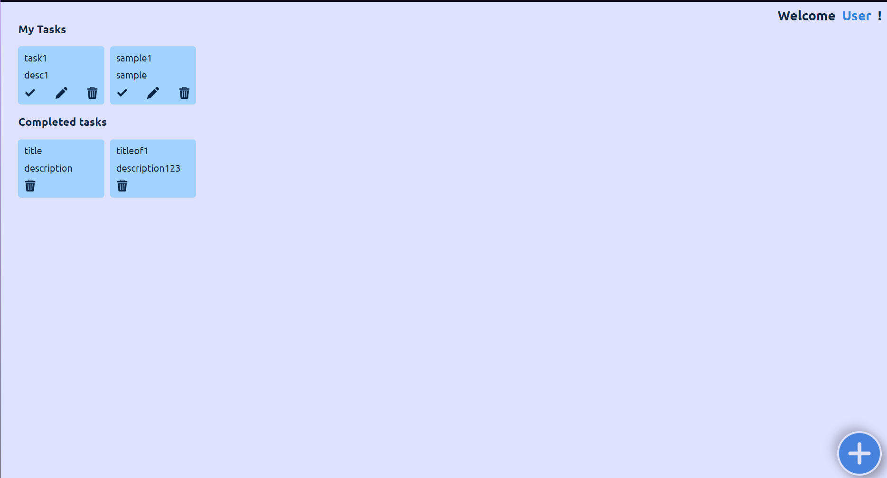
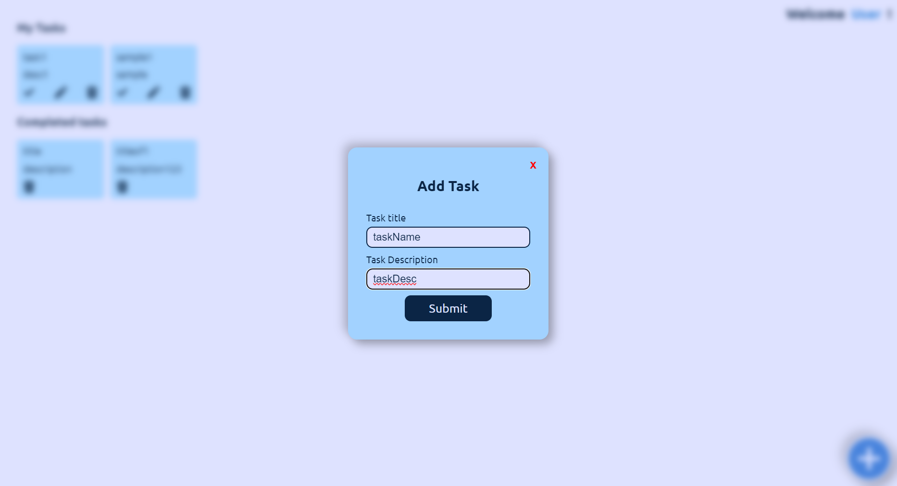
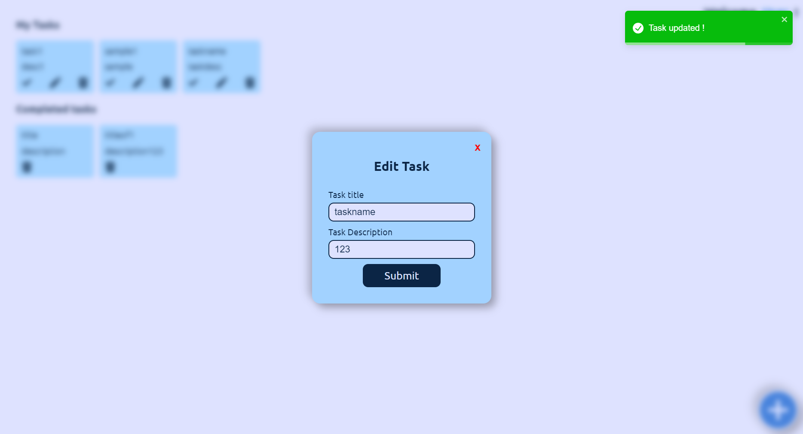
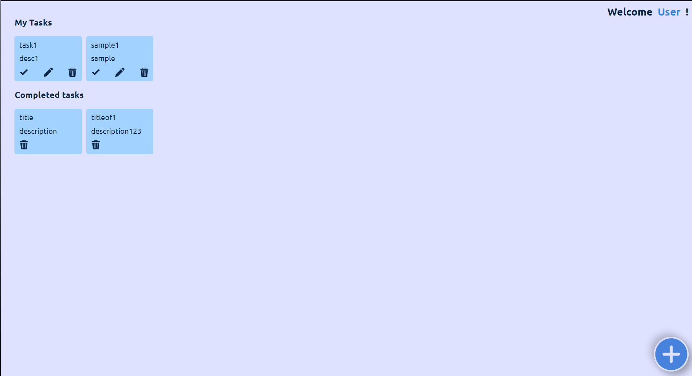

From the task provided

## Dashboard of task manager

## POST

creation of new task has been implemention by clicking on the plus button on bottom right corner we can add a task by default its status of completion is false

## GET

by default the dashboard will run get request using use effect hook in react and view the tasks available

## PATCH / UPDATE

by clicking the pen icon in each task it will prompt by pre filling the existing data of the respecitve task and we can update it

## DELETE

by clicking the delete bin on each task we get a prompt asking to confirm deletion where we can delete the task

## Video

<video src="./taskManager.mp4" controls></video>
